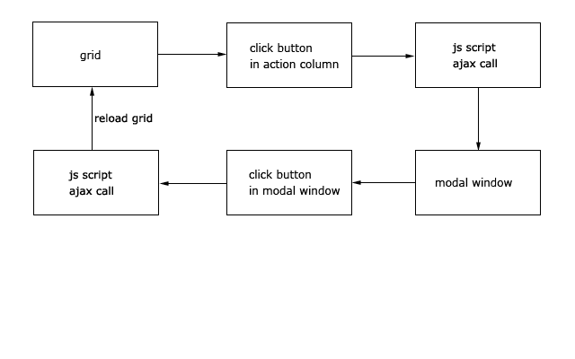

## CRUD grid with all actions by ajax

This example is based on CRUD grid implemented by standard `gii` generator.

* wrap the grid in the `index.php` view file by `pjax` widget. This will provide sorting, searching and pagination actions by ajax.

* name grid action buttons in the *template* property of the grid action column, e.g. `'template' => '{view}{update}{delete}'`

* for each button action make a link to a controller's action. Add to link the attribute `pjax` with the value `"0"`

* create js script for the grid page. This script makes ajax call to certain controller's action and opens the modal window as a result of this ajax call.

* if user's operations in the modal window change the grid data then create js script in modal window that makes ajax call to action to save model's data and reload the grid's pjax.

