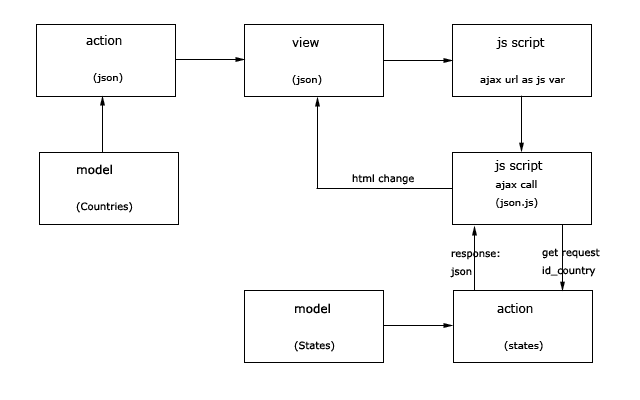

## Passing data from server in json format

To make a server response in json format:

* add to action type of response format as follows: `Yii::$app->response->format = Response::FORMAT_JSON;`

* then you can return to ajax call in js script array, object or something else. Data will be converted to json automatically.

* in ajax call put the url of this action. In example this url is passed to js file as external js variable.

