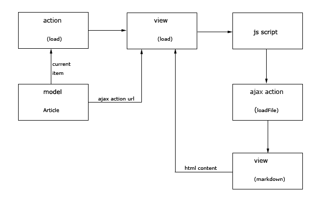

## Simple loading html content using ajax.

* Create action for the ajax call. This action has to render the view that returns html content by calling `renderPartial` method. Restrict access to this action using `Yii::$app->request->isAjax`.
* In the main view create elements that contain the url to ajax action. It may be *href* attribute of *a* tag or *value* attribute of *option* tag or something else.
* In the main view file create a container (maybe *div*) for the html content
* Register js file in the main view that calls ajax action when a when a specific event occurs.

